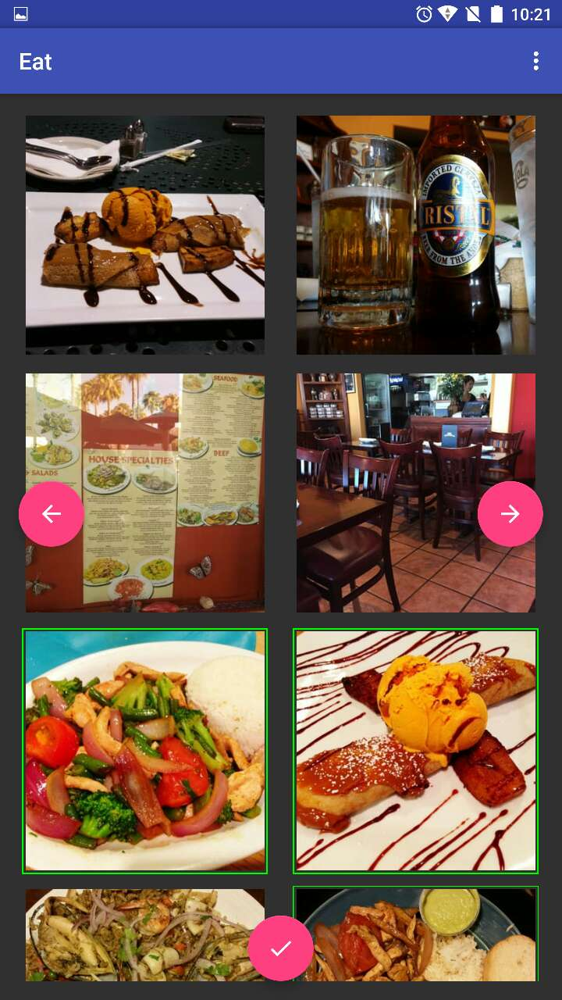
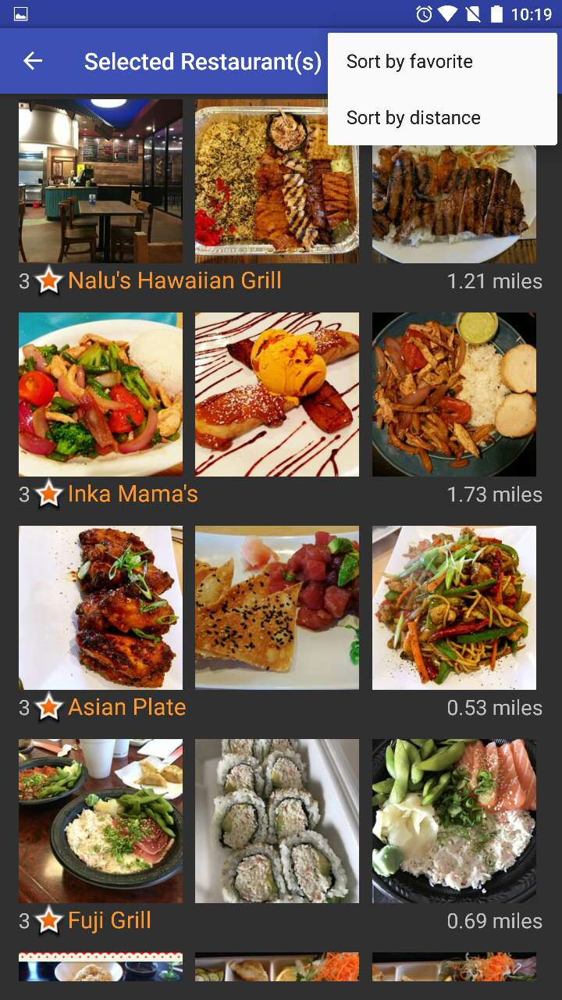
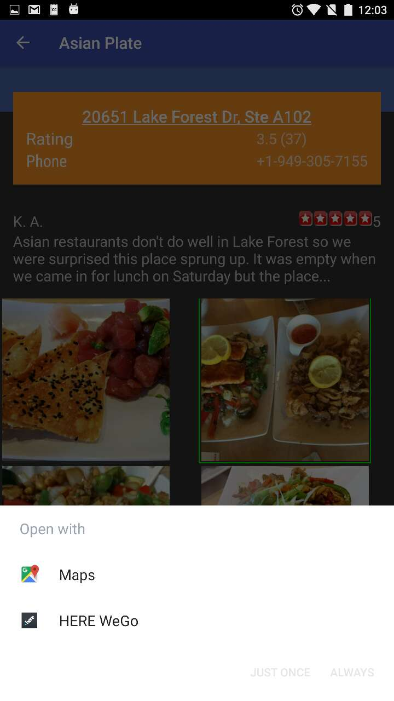
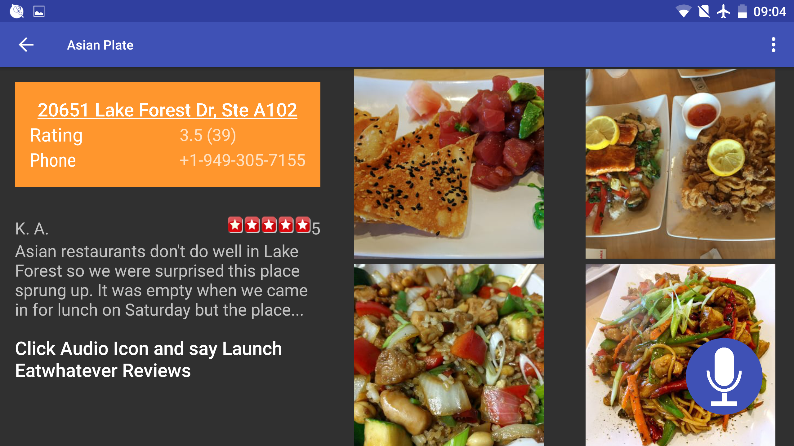

# Eat
<h3>Get rid of the hard problem of choosing restaurants with this app</h3>

Main Activity

 

Display Selected Restaurants

 

Restaurant Navigation

 

Restaurant Details Horizontal View

 
<!--

-->
